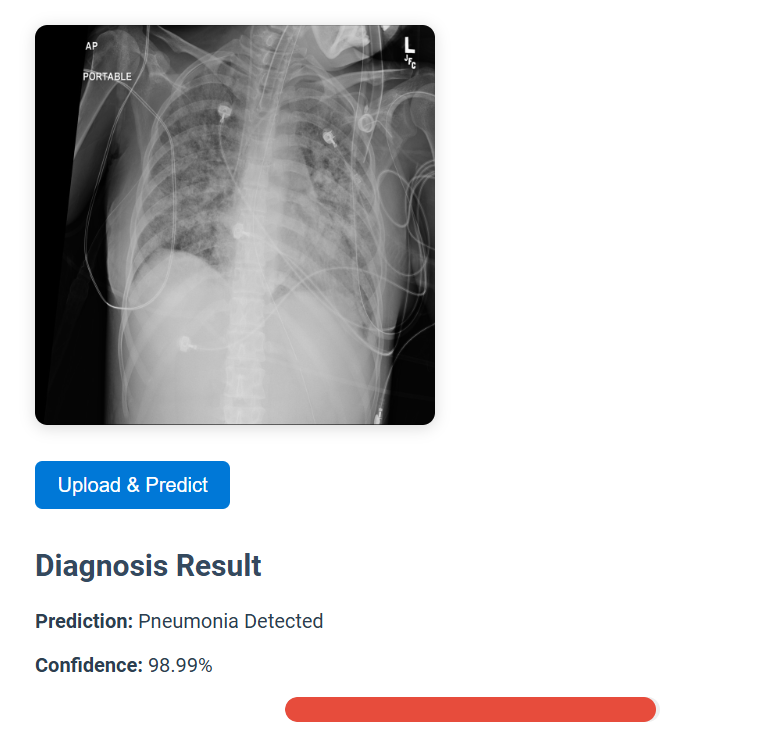
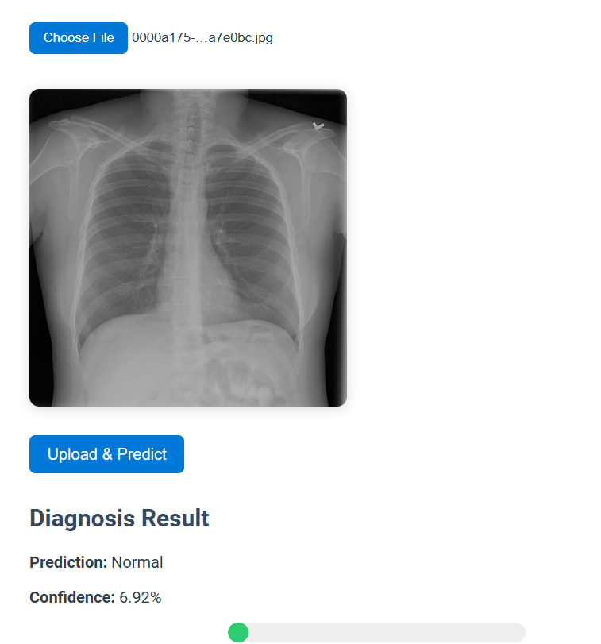
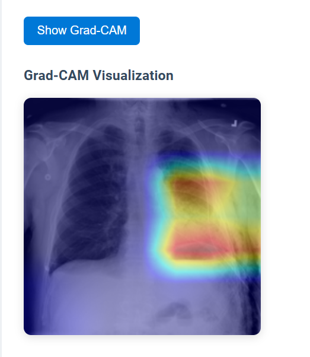

# MedBot AI – Pneumonia Detection from Chest X-rays

**MedBot** is an AI-powered web application that detects pneumonia from X-ray scans using a deep learning model (DenseNet121).  
Users can upload images through a simple web interface and receive instant predictions with confidence scores.

## Tech Stack
- **Frontend:** React.js  
- **Backend:** FastAPI  
- **AI Model:** PyTorch (DenseNet121)  
- **Dataset:** RSNA Pneumonia Detection Challenge  

## Features
- Upload X-ray images  
- Real-time pneumonia detection  
- Confidence scores  
- GPU acceleration (CUDA)  
- Modular backend for future Grad-CAM visualizations
- Grad-CAM heatmaps for visual explainability

## Project Structure

```bash
medbot-ai/
├── backend/               # FastAPI backend (AI inference API)
├── frontend/              # React.js upload interface
├── model/                 # PyTorch models + weights
├── notebooks/             # Training, evaluation, visualization notebooks
├── data/                  # (local only, ignored in repo)
└── README.md
```

## Model Overview

MedBot leverages multiple convolutional neural networks (CNNs) to classify pneumonia from chest X-rays.  
Three backbone models were compared under identical training conditions (3 epochs):

| Model | Accuracy | F1-Score | AUC | Validation Loss | Training Time (s) |
|:------|:----------|:----------|:------|:----------------|:------------------|
| **DenseNet121** | **0.770** | **0.779** | **0.8315** | 0.5336 | 131.88 |
| ResNet50 | 0.755 | 0.726 | 0.8419 | 0.6388 | 76.92 |
| EfficientNetB0 | 0.750 | 0.740 | 0.8364 | 0.5169 | 52.67 |

**Result:** 
> “DenseNet121 outperformed both ResNet50 and EfficientNetB0 in terms of *accuracy* and *AUC*, making it the most effective baseline model for pneumonia detection.“
---

## DensePneumo-ACE: Model Extension

After establishing DenseNet121 as the superior baseline, we introduced a novel hybrid enhancement called **DensePneumo-ACE**, featuring:

- **Adaptive Contrastive Enhancement (ACE):**  
  Self-supervised pretraining that improves feature separability and generalization.
- **Lung-Masked Attention Fusion (LMAF):**  
  A lightweight attention module focusing only on lung regions for anatomically aware detection.
- **Explainability:**  
  Integrated **Grad-CAM** visualizations that highlight the model’s attention over pneumonia regions.


---
## Training Results

| Model Variant | Epochs | Accuracy | F1-Score | AUC |
|:---------------|:-------:|:----------|:----------|:------|
| **DensePneumo-ACE (3 epochs)** | 3 | 0.842 | 0.725 | 0.9058 |
| **DensePneumo-ACE (10 epochs)** | 10 | **0.868** | **0.796** | **0.9198** |

 **Key Observations:**
- Accuracy improved from **0.77 → 0.868** (Δ +9.8%)  
- AUC improved from **0.8315 → 0.9198** (Δ +8.8%)  
- F1-score improved after longer training (0.725 → 0.796)  
- Smooth loss curve (0.42 → 0.06) confirms stable convergence  
- Training remained computationally efficient with minimal overhead  

---
---

## Visualization Examples

- **Training Loss Curve:** Smooth convergence across 10 epochs  
- **Model Comparison Plot:** Baseline vs. Hybrid (3 vs 10 epochs)  
- **Grad-CAM Heatmaps:** Lung-region attention visualization highlighting infected areas  

*(Plots generated using Matplotlib; see `/notebooks/visualizations.ipynb`)*

---
## 🖥️ User Interface

MedBot AI provides a simple, intuitive web interface built using React.js and FastAPI.

### Pneumonia Detected
Upload an X-ray image and click **"Detect Pneumonia"**.



---

### Pneumonia not Detected
Once an image is uploaded, the backend (FastAPI + PyTorch) processes it and returns the prediction with a **confidence score**.



---

### Grad-CAM Visualization
The system generates a **Grad-CAM heatmap** highlighting pneumonia regions for explainability.


---
## Conclusion

The experiments conclusively show that:
- **DenseNet121** is a stronger backbone for pneumonia detection than ResNet50 and EfficientNetB0.  
- The proposed **DensePneumo-ACE** hybrid further enhances diagnostic performance through self-supervised contrastive pretraining and lung-masked attention.
- After 10 epochs of training on the RSNA dataset, the model achieved **AUC = 0.9198**, validating its clinical potential.

> *“DensePneumo-ACE improves pneumonia detection AUC by nearly 9% over DenseNet121 with minimal computational cost.”*

---
